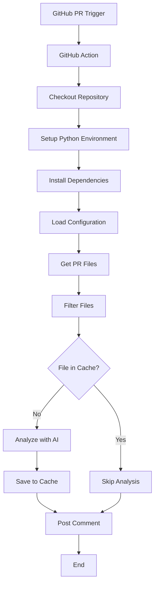

# 📚 Documentação Técnica Completa - AI Code Review Action

## 📋 Índice

1. [Visão Geral](#-visão-geral)
2. [Arquitetura do Sistema](#-arquitetura-do-sistema)
3. [Documentação dos Arquivos](#-documentação-dos-arquivos)
   - [action.yml](#actionyml)
   - [scripts/ai_review_pr.py](#scriptsai_review_prpy)
   - [scripts/release.sh](#scriptsreleasebash)
   - [README.md](#readmemd)
4. [Fluxo de Execução](#-fluxo-de-execução)
5. [Configurações e Parâmetros](#-configurações-e-parâmetros)
6. [Sistema de Cache](#-sistema-de-cache)
7. [Sistema de Ignore](#-sistema-de-ignore)
8. [Troubleshooting](#-troubleshooting)

---

## 🎯 Visão Geral

A **AI Code Review Action** é uma GitHub Action que realiza análise automática de código usando Inteligência Artificial. O sistema suporta múltiplos provedores de IA (OpenAI e Anthropic Claude) e oferece análise detalhada de segurança, qualidade e boas práticas de código.

### Características Principais

- 🔍 **Análise Inteligente**: Usa GPT-4/5 ou Claude 3.x para análise contextual
- 🛡️ **Foco em Segurança**: Detecta vulnerabilidades comuns (SQLi, XSS, etc.)
- ⚡ **Sistema de Cache**: Evita re-análise de arquivos idênticos
- 🚫 **Filtros Avançados**: Sistema flexível de ignore (regex + arquivo)
- 📊 **Configurável**: Limites, modelos e padrões personalizáveis
- 💬 **Integração GitHub**: Comentários automáticos em PRs

---

## 🏗️ Arquitetura do Sistema



### Componentes Principais

1. **GitHub Action Runner** (`action.yml`)

   - Configuração da action
   - Gerenciamento de dependências
   - Variáveis de ambiente

2. **Script de Análise** (`ai_review_pr.py`)

   - Lógica principal de análise
   - Integração com APIs de IA
   - Sistema de cache
   - Filtros de arquivos

3. **Script de Release** (`release.sh`)
   - Automação de releases
   - Gerenciamento de tags
   - Versionamento semântico

---

## 📄 Documentação dos Arquivos

### `action.yml`

**Propósito**: Configuração principal da GitHub Action que define inputs, outputs e steps de execução.

#### Estrutura

```yaml
# Metadados da Action
name: "AI Code Review Action"
description: "Executa revisão automática de código com GPT-5 (ou ClaudeAI) e publica feedback no PR."
author: "Filipe Pires"
branding:
  icon: "check-circle"
  color: "blue"
```

#### Inputs Configurados

| Input                 | Tipo   | Obrigatório | Descrição                                  |
| --------------------- | ------ | ----------- | ------------------------------------------ |
| `openai_api_key`      | string | Não\*       | Chave da API OpenAI                        |
| `claude_api_key`      | string | Não\*       | Chave da API Anthropic Claude              |
| `github_token`        | string | ✅          | Token do GitHub para comentar no PR        |
| `pr_number`           | string | ✅          | Número do Pull Request                     |
| `repository`          | string | ✅          | Nome do repositório (owner/repo)           |
| `analyze_limit`       | string | Não         | Limite de arquivos a analisar (padrão: 10) |
| `model`               | string | Não         | Modelo de IA a usar (padrão: gpt-5)        |
| `ignore_file_content` | string | Não         | Padrões regex para ignorar                 |
| `ignore_file_path`    | string | Não         | Caminho do arquivo de ignore               |
| `guidelines_path`     | string | Não         | Caminho do arquivo de diretrizes           |

> \*Pelo menos uma das chaves de API é obrigatória.

#### Steps de Execução

1. **Checkout Repository**: Baixa o código do repositório
2. **Download Cache**: Baixa cache de análises anteriores (se existir)
3. **Cache pip**: Cacheia dependências Python para otimização
4. **Setup Python**: Configura ambiente Python 3.11
5. **Install Dependencies**: Instala pacotes do `requirements.txt`
6. **Run AI Review script**: Executa o script principal
7. **Upload Cache**: Salva cache de análises para próximas execuções

#### Melhorias Implementadas

- ✅ **Cache Automático**: Sistema de cache baseado em GitHub Artifacts
- ✅ **Diretrizes Personalizadas**: Sistema de diretrizes configurável por projeto
- ✅ **Cache de Dependências**: Usa `actions/cache@v4` para acelerar builds
- ✅ **Requirements.txt**: Gerenciamento centralizado de dependências
- ✅ **Variáveis Renomeadas**: `claude_ai_key` → `claude_api_key`
- ✅ **Parâmetros Atualizados**: `ignore_patterns` → `ignore_file_content`

---

### `scripts/ai_review_pr.py`

**Propósito**: Script principal que realiza a análise de código usando IA e publica comentários no PR.

#### Funcionalidades Principais

##### 🔧 Sistema de Cache

```python
# Diretório base do cache persistente
CACHE_DIR = os.path.join(os.getenv("GITHUB_WORKSPACE", "."), "ai_review_cache")
os.makedirs(CACHE_DIR, exist_ok=True)

def get_file_hash(content: str):
    """Gera hash único de um arquivo (SHA-256)."""
    return hashlib.sha256(content.encode("utf-8")).hexdigest()

def load_cache(file_hash: str):
    """Carrega resultado de cache se existir."""
    path = os.path.join(CACHE_DIR, f"{file_hash}.json")
    if os.path.exists(path):
        with open(path, "r", encoding="utf-8") as f:
            return json.load(f)
    return None
```

**Benefícios do Cache:**

- ⚡ **Performance**: Evita re-análise de arquivos idênticos
- 💰 **Economia**: Reduz chamadas desnecessárias às APIs de IA
- 🔄 **Consistência**: Garante resultados idênticos para código igual

##### 🚫 Sistema de Ignore Avançado

```python
def should_ignore(filename, ignore_globs, ignore_regex):
    """Verifica se um arquivo deve ser ignorado baseado nos padrões configurados."""
    # Usa pathspec para compatibilidade com .gitignore
    spec_globs = pathspec.PathSpec.from_lines("gitwildmatch", ignore_globs)
    spec_regex = pathspec.PathSpec.from_lines("gitwildmatch", ignore_regex)
    if spec_globs.match_file(filename) or spec_regex.match_file(filename):
        return True
    return False
```

**Melhorias:**

- ✅ **Pathspec**: Substitui `fnmatch` por `pathspec` para melhor compatibilidade
- ✅ **Gitignore Syntax**: Suporte completo à sintaxe do `.gitignore`
- ✅ **Regex + Glob**: Combina padrões glob e regex

##### 📋 Sistema de Diretrizes Personalizadas

```python
def load_guidelines():
    """
    Lê o arquivo de diretrizes do projeto (Markdown) para usar como prompt base.
    """
    guidelines_path = os.path.join(WORKSPACE, "knowledge", "ai-review-guidelines.md")
    if not os.path.exists(guidelines_path):
        log(f"⚠️ Arquivo de diretrizes não encontrado em: {guidelines_path}")
        return ""
    with open(guidelines_path, "r", encoding="utf-8") as f:
        return f.read()

# Uso no prompt
guidelines = load_guidelines()
prompt = f"{guidelines}\n\nAgora analise o arquivo `{filename}` com base nessas diretrizes."
```

**Características do Sistema:**

- 📝 **Flexível**: Permite definir diretrizes específicas do projeto
- 🎯 **Consistente**: Garante análises alinhadas com padrões da equipe
- 🔧 **Configurável**: Arquivo de diretrizes personalizável por projeto
- 📚 **Documentado**: Diretrizes claras e organizadas em Markdown

##### 🤖 Integração com APIs de IA

**OpenAI Integration:**

```python
def call_openai(prompt, code_chunk):
    import openai
    openai.api_key = OPENAI_API_KEY
    response = openai.chat.completions.create(
        model=MODEL_NAME,
        messages=[
            {"role": "system", "content": "Você é um engenheiro de software e segurança."},
            {"role": "user", "content": f"{prompt}\n\n{code_chunk}"}
        ],
        temperature=0.6,  # Baixa temperatura para respostas consistentes
    )
    return response.choices[0].message.content.strip()
```

**Claude Integration:**

```python
def call_claude(prompt, code_chunk):
    from anthropic import Anthropic
    client = Anthropic(api_key=CLAUDE_API_KEY)
    response = client.messages.create(
        model=MODEL_NAME if MODEL_NAME.startswith("claude") else 'claude-sonnet-4-5',
        max_tokens=1024,  # Limite otimizado
        temperature=0.6,
        messages=[
            {"role": "user", "content": f"{prompt}\n\n{code_chunk}"}
        ]
    )
    return response.content[0].text.strip()
```

##### 📝 Sistema de Truncamento Inteligente

```python
def shorten_multiline(text, width, placeholder=' [...]'):
    """
    Encurta um texto de múltiplas linhas preservando quebras de linha.
    """
    if len(text) <= width:
        return text

    lines = text.splitlines()
    output = []
    current_length = 0

    for line in lines:
        if current_length + len(line) <= width - len(placeholder):
            output.append(line)
            current_length += len(line) + 1
        else:
            remaining_width = width - current_length - len(placeholder)
            if remaining_width > 0:
                output.append(line[:remaining_width])
            output.append(placeholder)
            break

    return "\n".join(output)
```

**Características:**

- ✅ **Preserva Formatação**: Mantém quebras de linha do Markdown
- ✅ **Limite GitHub**: Respeita limite de 65.536 caracteres do GitHub
- ✅ **Truncamento Inteligente**: Para em pontos lógicos

##### 🔄 Fluxo de Análise Otimizado

```python
# Verifica cache antes da análise
file_hash = get_file_hash(content)
cached = load_cache(file_hash)
if cached:
    log(f"  └── ⚡ Arquivo cacheado")
    return cached["analysis"]

# Análise com IA
chunks = chunk_code(content)
report = ""
for chunk in chunks:
    if OPENAI_API_KEY:
        report += call_openai(prompt, chunk) + "\n\n"
    elif CLAUDE_API_KEY:
        report += call_claude(prompt, chunk) + "\n\n"

# Salva no cache
save_cache(file_hash, {"filename": filename, "analysis": report})
```

#### Novas Dependências

```python
import hashlib      # Para geração de hash SHA-256
import json         # Para serialização do cache
import pathspec     # Para compatibilidade com .gitignore
```

---

### `scripts/release.sh`

**Propósito**: Script para automatizar releases da GitHub Action com versionamento semântico.

#### Funcionalidades

##### 📋 Validação de Versão

```bash
# Validação de formato semântico (vX.Y.Z)
if [[ ! "$VERSION" =~ ^v[0-9]+\.[0-9]+\.[0-9]+$ ]]; then
  echo "❌ Versão inválida. Use o formato semântico:"
  echo "   Exemplos válidos: v1.0.0, v2.1.3, v10.5.2"
  echo "   Formato: v[MAJOR].[MINOR].[PATCH]"
  exit 1
fi
```

##### 🏷️ Gerenciamento de Tags

```bash
# Cria tag exata
git tag -a "$VERSION" -m "Release $VERSION"
git push origin "$VERSION"

# Atualiza alias major (ex: v1)
git tag -f "$MAJOR_TAG"
git push origin "$MAJOR_TAG" --force

# Opcional: atualiza alias latest
if [ -n "$ISLATEST" ]; then
  git tag -f latest
  git push origin latest --force
fi
```

#### Uso

```bash
# Release básica
./scripts/release.sh v1.2.0

# Release com alias latest
./scripts/release.sh v1.2.0 true
```

---

### `README.md`

**Propósito**: Documentação principal do projeto para usuários finais.

#### Estrutura da Documentação

1. **Badges**: Status do projeto (release, license, stars)
2. **Funcionalidades**: Detalhamento das capacidades
3. **Configuração**: Guia passo-a-passo
4. **Parâmetros**: Tabelas detalhadas de configuração
5. **Exemplos**: Casos de uso práticos
6. **Desenvolvimento**: Informações para contribuidores

#### Melhorias Implementadas

- ✅ **Tabelas Formatadas**: Melhor legibilidade dos parâmetros
- ✅ **Exemplos Atualizados**: Refletem mudanças nos parâmetros
- ✅ **Seções Organizadas**: Estrutura mais clara e navegável
- ✅ **Badges GitHub**: Credibilidade e status do projeto

---

## 🔄 Fluxo de Execução

### 1. Trigger da Action

```yaml
on:
  pull_request:
    types: [opened, synchronize, reopened]
```

### 2. Preparação do Ambiente

- Checkout do repositório
- Cache de dependências Python
- Setup do Python 3.11
- Instalação de dependências

### 3. Carregamento de Configurações

```python
# Variáveis de ambiente
OPENAI_API_KEY = os.getenv("OPENAI_API_KEY")
CLAUDE_API_KEY = os.getenv("CLAUDE_API_KEY")
MODEL_NAME = os.getenv("MODEL_NAME", "gpt-5")
ANALYZE_LIMIT = int(os.getenv("ANALYZE_LIMIT", "10"))
IGNORE_FILE_CONTENT = os.getenv("IGNORE_FILE_CONTENT", "")
IGNORE_FILE_PATH = os.getenv("IGNORE_FILE_PATH") or ".ai-review-ignore"
```

### 4. Análise do Pull Request

```python
pr = get_pull_request()
log(f"🔍 Analisando PR #{PR_NUMBER}: {pr.title}")
```

### 5. Filtragem de Arquivos

```python
for f in pr.get_files():
    # Verifica limite
    if len(changed_files) >= ANALYZE_LIMIT:
        break

    # Verifica extensão
    if not f.filename.endswith(SUPPORTED_EXTENSIONS):
        continue

    # Verifica ignore
    if should_ignore(f.filename, ignore_globs, ignore_regex):
        continue

    # Verifica cache
    file_hash = get_file_hash(content)
    cached = load_cache(file_hash)
    if cached is not None:
        continue
```

### 6. Análise com IA

```python
for filename, content in changed_files:
    analysis = analyze_code(filename, content)
    if analysis is None:
        continue

    # Trunca e publica
    summary = shorten_multiline(report, 60000)
    post_comment(pr, summary)
```

---

## ⚙️ Configurações e Parâmetros

### Variáveis de Ambiente

| Variável              | Descrição                     | Padrão                              |
| --------------------- | ----------------------------- | ----------------------------------- |
| `OPENAI_API_KEY`      | Chave da API OpenAI           | -                                   |
| `CLAUDE_API_KEY`      | Chave da API Anthropic Claude | -                                   |
| `MODEL_NAME`          | Modelo de IA a usar           | `gpt-5`                             |
| `GITHUB_TOKEN`        | Token do GitHub               | -                                   |
| `GITHUB_REPOSITORY`   | Repositório (owner/repo)      | -                                   |
| `GITHUB_PR_NUMBER`    | Número do PR                  | -                                   |
| `ANALYZE_LIMIT`       | Limite de arquivos            | `10`                                |
| `IGNORE_FILE_CONTENT` | Padrões regex                 | `""`                                |
| `IGNORE_FILE_PATH`    | Arquivo de ignore             | `.ai-review-ignore`                 |
| `GUIDELINES_PATH`     | Arquivo de diretrizes         | `knowledge/ai-review-guidelines.md` |
| `CACHE_DIR`           | Diretório do cache            | `cache`                             |

### Modelos Suportados

**OpenAI:**

- `gpt-4-mini`
- `gpt-4`
- `gpt-4-turbo`
- `gpt-5`

**Claude:**

- `claude-opus-4-1`
- `claude-haiku-4-5`
- `claude-sonnet-4-5` (padrão para Claude)

### Extensões Suportadas

```python
SUPPORTED_EXTENSIONS = (
    ".py", ".js", ".ts", ".tsx", ".jsx", ".java", ".cs", ".php",
    ".rb", ".go", ".swift", ".kt", ".rs"
)
```

---

## 💾 Sistema de Cache Automático

### Configuração do Cache

O sistema de cache agora é **totalmente automático** e baseado em GitHub Artifacts:

```yaml
# Download do cache (automático)
- name: Baixar cache de análise da IA
  uses: actions/download-artifact@v4
  with:
    name: ai-review-cache-pr-${{ github.event.pull_request.number }}
    path: ${{ github.workspace }}/cache/
  continue-on-error: true

# Upload do cache (automático)
- name: Salvar cache de análise da IA
  uses: actions/upload-artifact@v4
  with:
    name: ai-review-cache-pr-${{ github.event.pull_request.number }}
    path: ${{ github.workspace }}/cache/
```

**Características do Sistema:**

| Característica  | Descrição                                 |
| --------------- | ----------------------------------------- |
| **Automático**  | Não requer configuração manual            |
| **Persistente** | Cache mantido entre execuções do mesmo PR |
| **Isolado**     | Cache específico por Pull Request         |
| **Eficiente**   | Usa GitHub Artifacts para armazenamento   |

### Estrutura do Cache

```
cache/ai_review_cache/
├── {hash1}.json
├── {hash2}.json
└── ...
```

**Exemplo de estrutura:**

```
${{ github.workspace }}/cache/ai_review_cache/
├── a1b2c3d4e5f6.json
├── f6e5d4c3b2a1.json
└── ...
```

### Formato dos Arquivos de Cache

```json
{
  "filename": "src/auth/login.py",
  "analysis": "### 📄 src/auth/login.py\n**Vulnerabilidades**\n- ..."
}
```

### Benefícios

- ⚡ **Performance**: Evita re-análise de arquivos idênticos
- 💰 **Economia**: Reduz custos de API
- 🔄 **Consistência**: Resultados idênticos para código igual
- 📊 **Escalabilidade**: Melhora performance em PRs grandes

### Limpeza do Cache

O cache é gerenciado automaticamente pelo GitHub Artifacts. Para limpeza manual:

**Limpeza local (durante execução):**

```bash
rm -rf cache/ai_review_cache/
```

**Limpeza de artifacts (via GitHub UI):**

1. Vá para Actions > Artifacts
2. Encontre `ai-review-cache-pr-{numero}`
3. Clique em "Delete"

**Limpeza programática:**

```python
import os
import shutil

cache_dir = os.path.join(os.getenv("GITHUB_WORKSPACE", "."), "cache", "ai_review_cache")
if os.path.exists(cache_dir):
    shutil.rmtree(cache_dir)
    print(f"Cache limpo: {cache_dir}")
```

---

## 📋 Sistema de Diretrizes Personalizadas

### Configuração das Diretrizes

O sistema permite definir diretrizes específicas do projeto através do arquivo `knowledge/ai-review-guidelines.md`:

```markdown
# Diretrizes de Análise de Código (IA)

Você deve analisar o código seguindo os princípios abaixo:

- Clean Code, SOLID, KISS, DRY
- Boas práticas de segurança (XSS, SQL Injection, CSRF, credenciais expostas)
- Manutenibilidade, legibilidade e organização
- Não reescrever o código inteiro, apenas sugerir melhorias objetivas
- Responder sempre no formato:

### 📄 {nome_do_arquivo}

**Vulnerabilidades**

- ...

**Melhorias sugeridas**

- ...

**Resumo final**

- ...
```

### Características do Sistema

| Característica   | Descrição                                         |
| ---------------- | ------------------------------------------------- |
| **Flexível**     | Permite definir diretrizes específicas do projeto |
| **Consistente**  | Garante análises alinhadas com padrões da equipe  |
| **Configurável** | Arquivo de diretrizes personalizável por projeto  |
| **Documentado**  | Diretrizes claras e organizadas em Markdown       |

### Exemplos de Diretrizes Específicas

- **Padrões de Nomenclatura**: Convenções específicas da equipe
- **Arquitetura**: Padrões arquiteturais do projeto
- **Segurança**: Regras de segurança particulares do domínio
- **Formato**: Formato de resposta personalizado
- **Qualidade**: Critérios de qualidade específicos

### Configuração via Action

```yaml
- uses: filipepiresg/ai-code-review-action@v1
  with:
    guidelines_path: "docs/code-review-rules.md"
```

---

## 🚫 Sistema de Ignore

### Tipos de Ignore

#### 1. Arquivo de Ignore (`.ai-review-ignore`)

```gitignore
# Arquivos de teste
**/*.test.js
**/*.spec.js
**/__tests__/

# Dependências
node_modules/
vendor/

# Arquivos de configuração
*.json
*.lock
*.log
```

#### 2. Padrões Regex (via `ignore_file_content`)

```yaml
ignore_file_content: |
  ^src/__tests__/
  ^node_modules/
  \.{test,spec}.{j,t}s?(x)$
  \.json$
  \.lock$
```

### Prioridade

1. **Arquivo de ignore** (`.ai-review-ignore`)
2. **Padrões regex** (`ignore_file_content`)

### Compatibilidade

- ✅ **Gitignore Syntax**: Suporte completo à sintaxe do `.gitignore`
- ✅ **Pathspec**: Usa `pathspec` para máxima compatibilidade
- ✅ **Regex**: Suporte a padrões regex complexos

---

## 🔧 Troubleshooting

### Problemas Comuns

#### 1. Chave de API Não Configurada

```
❌ Nenhuma chave de LLM informada. Use openai_api_key ou claude_api_key.
```

**Solução**: Configure pelo menos uma das chaves em `Settings > Secrets > Actions`

#### 2. Arquivo de Ignore Não Encontrado

```
⚠️ Arquivo de ignore não encontrado: /path/to/.ai-review-ignore
```

**Solução**: Crie o arquivo ou ajuste o caminho em `ignore_file_path`

#### 3. Regex Inválida

```
⚠️ Regex inválida ignorada: [invalid-pattern] (error details)
```

**Solução**: Verifique a sintaxe da regex em `ignore_file_content`

#### 4. Limite de Arquivos Excedido

```
📦 10 arquivos serão analisados usando OpenAI.
```

**Solução**: Ajuste `analyze_limit` se necessário

### Debug

#### Variáveis de Debug

```python
print("======== DEBUG VARS: ========")
for var in ["GITHUB_REPOSITORY", "GITHUB_PR_NUMBER", "OPENAI_API_KEY",
           "CLAUDE_API_KEY", "MODEL_NAME", "ANALYZE_LIMIT",
           "IGNORE_FILE_CONTENT", "IGNORE_FILE_PATH", "CACHE_DIR"]:
    print(f" - {var}={os.getenv(var)}")
print("=============================")
```

#### Logs Detalhados

```python
log(f"🔍 Analisando PR #{PR_NUMBER}: {pr.title}")
log(f"📄 Carregando padrões de ignore: {ignore_path}")
log(f"🚫 Ignorado: {f.filename}")
log(f"⚡ Arquivo cacheado")
log(f"🧠 Arquivo sem cache")
```

### Performance

#### Otimizações Implementadas

- ✅ **Cache de Dependências**: `actions/cache@v4` para pip
- ✅ **Cache de Análise**: Evita re-análise de arquivos idênticos
- ✅ **Chunking**: Divide arquivos grandes em blocos
- ✅ **Truncamento**: Respeita limites do GitHub
- ✅ **Filtros**: Ignora arquivos desnecessários

#### Métricas de Performance

- **Tempo de Setup**: ~30-60s (com cache)
- **Análise por Arquivo**: ~5-15s (dependendo do tamanho)
- **Cache Hit Rate**: ~70-90% (em projetos ativos)

---

## 📈 Melhorias Futuras

### Roadmap Sugerido

1. **Suporte a Mais Linguagens**

   - C/C++ (.c, .cpp, .h)
   - Dart (.dart)
   - Kotlin (.kt)
   - Scala (.scala)

2. **Análise Avançada**

   - Detecção de code smells
   - Análise de complexidade ciclomática
   - Sugestões de refatoração

3. **Integração com Ferramentas**

   - ESLint/Prettier
   - SonarQube
   - CodeClimate

4. **UI/UX Melhorias**

   - Dashboard de métricas
   - Relatórios históricos
   - Configuração via interface

5. **Performance**
   - Análise paralela
   - Cache distribuído
   - Otimizações de API

---

## 📞 Suporte e Contribuição

### Como Contribuir

1. Fork o projeto
2. Crie uma branch para sua feature
3. Commit suas mudanças
4. Push para a branch
5. Abra um Pull Request

### Reportar Bugs

- Use o sistema de Issues do GitHub
- Inclua logs de debug
- Descreva o comportamento esperado vs atual

### Sugestões

- Use Discussions para ideias
- Proponha melhorias via Issues
- Participe da comunidade

---

**Documentação criada em**: $(date)  
**Versão**: 2.0.0  
**Autor**: Filipe Pires  
**Última atualização**: Considerando todas as mudanças implementadas
